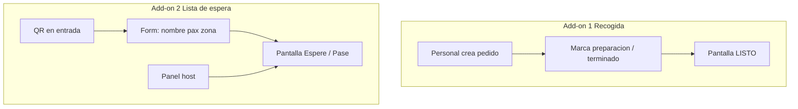

# Ideas para próximas versiones — Add-ons operación en sala

Documento de producto (no implementado). Recoge la línea acordada para dos **add-ons independientes** de la carta QR y de TVPik, orientados a operación en el local: recogida de pedidos en pantalla y lista de espera con formulario + pantalla pública.

**Estado:** exploración / diseño  
**Última actualización:** mayo 2026  
**Relacionado:** [PLATFORM-BILLING.md](PLATFORM-BILLING.md), [PLATFORM-BILLING-TVPIK.md](PLATFORM-BILLING-TVPIK.md), [config/plans.php](../config/plans.php)

---

## Contexto

Webnu hoy cubre:

- Carta digital, QR, planes Free / Pro / Plus
- Add-on **TVPik** (cartas y contenido en pantallas TV)
- Reserva de mesa básica por email (`reservation` en negocio + formulario clásico)

**No existe** aún: cola de pedidos para recoger, ni lista de espera walk-in en tiempo real.

Se descartó como núcleo del add-on de recogida el flujo «cliente escanea QR → página con alarma en el móvil», por limitaciones de navegador (pestaña cerrada, autoplay, adopción irregular). El enfoque acordado es **avisar en pantallas del local**.

---

## Visión: dos add-ons separados

| Add-on | Nombre orientativo | Para qué sirve |
|--------|-------------------|----------------|
| **1** | Recogida (pantallas) | Cocina/mostrador: pedido en preparación → terminado → visible en TV/tablet de recogida |
| **2** | Lista de espera | Host: cola de mesas; cliente se apunta por QR; pantalla «Espere» / «Pase» |

Un local puede contratar uno, otro o ambos. No comparten la misma cola ni la misma pantalla obligatoriamente.

---

## Add-on 1 — Recogida en pantallas

### Problema que resuelve

En bares, cafeterías, rotiserías o mostrador de takeaway, el cliente espera junto a la barra sin saber cuándo está el pedido. Una pantalla con números o nombres **listos para recoger** reduce preguntas y errores.

### Usuarios

- **Personal** (mostrador, cocina): crea y actualiza pedidos
- **Cliente:** mira la pantalla (y/o ticket con número); no requiere app ni mantener el móvil abierto en v1

### Estados del pedido (MVP)

| Estado | Uso | En pantalla pública |
|--------|-----|---------------------|
| `preparando` | Pedido registrado, en cocina | Opcional: lista discreta «En preparación» |
| `terminado` | Listo para recoger | **Destacado** (número grande, animación) |
| `recogido` | Entregado al cliente | Sale de la lista de «listos» |

Transiciones: personal con **un tap** en panel móvil/tablet (admin Webnu).

### Flujo operativo

1. Mostrador crea pedido: número corto (auto 1–99), nombre opcional, nota breve.
2. Cocina/mostrador marca **preparando** → **terminado**.
3. Pantalla en barra (`/recogida/{slug}` o plantilla TVPik «Recogida») muestra los terminados.
4. Al marcar **recogido**, desaparece de la vista «listos» (tras timeout configurable opcional).

### Pantallas

- **1+ pantallas** por negocio (TV o tablet en modo kiosco, fullscreen).
- Sonido y animación **en la propia pantalla** al entrar un nuevo «terminado» (sin depender del móvil del comensal).
- Reutilización posible del stack TVPik (plantilla de canal) o URL standalone más simple.

### Fuera de alcance en v1

- Carrito y pago desde la carta QR
- SMS / WhatsApp al cliente
- Alarma sonora en el teléfono del comensal como función principal
- Integración TPV/POS externo (fase posterior)

### Modelo de datos (borrador)

- `pickup_orders`: `company_id`, `number`, `status`, `customer_label`, `notes`, `ready_at`, `picked_up_at`, timestamps
- `pickup_settings` por `company_id`: sonido en pantalla, segundos visibles tras «terminado», idioma de textos

### Comercial (orientativo)

- Add-on en **Pro y Plus** (no Free), independiente de TVPik carta
- Ejemplo de precios (sin IVA, a validar):
  - **Recogida · 1 pantalla** — ~5 €/mes
  - **Recogida · pack pantallas** — ~15–20 €/mes (barra + sala de espera de pedidos)

Flags propuestos: `canUsePickupDisplay()`, `pickup_max_screens` (análogo a `tvpik_max_screens` en [UserPlanService](../app/Services/UserPlanService.php)).

---

## Add-on 2 — Lista de espera

### Problema que resuelve

Restaurante lleno: el cliente hace cola en la puerta. Hoy la reserva por email no sustituye una **cola walk-in** con visibilidad en pantalla y aviso de «ya puede pasar».

### Usuarios

- **Cliente:** escanea QR en entrada, rellena formulario corto
- **Host / mostrador:** panel para cambiar estado y orden
- **Público en sala de espera:** mira pantalla con nombres y estado

### Formulario del cliente (QR)

Campos MVP:

| Campo | Obligatorio | Notas |
|-------|-------------|--------|
| Nombre | Sí | En pantalla: nombre completo o iniciales (configurable) |
| Número de personas | Sí | Entero 1–20 |
| Sala o terraza | Sí | Opciones **definidas por el local** (ej. Interior, Terraza, Barra) |

URL orientativa: `/espera/{slug}/unirse` (misma base que la pantalla del local).

El cliente envía **una vez** y puede alejarse; no necesita dejar el navegador abierto.

### Estados en pantalla pública

| Estado | Texto en pantalla | Quién lo cambia |
|--------|-------------------|-----------------|
| `esperando` | «Espere» (o copy configurable) | Automático al registrarse |
| `pase` | «Pase» / «Mesa lista» | Host en panel |

Estados futuros: `no_presentado`, tiempo estimado, notificación SMS al pasar a `pase`.

### Pantalla de espera

- URL: `/espera/{slug}` en TV/tablet en la entrada
- Lista de entradas activas: nombre (+ opcional pax y zona), badge **Espere** / **Pase**
- Agrupación opcional por zona (Interior / Terraza)
- Privacidad: valorar no mostrar teléfono en pantalla pública

### Configuración del local (admin)

Por negocio (`waitlist_settings` o similar):

- Zonas editables (sala / terraza / barra…)
- ¿Nombre completo o solo iniciales en pantalla?
- Textos: «Espere», «Pase»
- ¿Permitir auto-registro por QR o solo alta manual del host?
- Tiempo estimado de espera (texto fijo o manual por turno)

### Diferencia con reserva actual

El flag `reservation` en [Company](../app/Company.php) y `table_reservation` en PagesController envían un **email** de solicitud de reserva. La lista de espera es **cola en tiempo real**, no sustituye ese flujo sin un rediseño explícito.

### Fuera de alcance en v1

- Reserva con fecha y hora
- Pago de señal
- Asignación automática de número de mesa
- Integración con TPV

### Modelo de datos (borrador)

- `waitlist_entries`: `company_id`, `name`, `party_size`, `zone`, `status`, `position`, `notes`, timestamps
- `waitlist_zones`: `company_id`, `label`, `sort_order`, `enabled`

### Comercial (orientativo)

- Add-on en **Pro y Plus**
- Ejemplo (sin IVA, a validar):
  - **Lista de espera · 1 pantalla** — ~5–7 €/mes
  - Pack pantallas o bundle **«Operación sala»** (Recogida + Espera) con descuento

Flags propuestos: `canUseWaitlist()`, `waitlist_max_screens`.

---

## Comparativa rápida

| | Recogida | Lista de espera |
|---|----------|-----------------|
| Cola | Pedidos de comida | Personas / mesas |
| Cliente usa form público | No (v1) | Sí |
| Pantalla muestra | Nº / nombre **LISTO** | Nombre **ESPERE / PASE** |
| Actor principal | Cocina / mostrador | Host |
| Encaja en | Takeaway, barra, café | Restaurante lleno, terraza con cola |

---

## Riesgos y mitigaciones

### Recogida

| Riesgo | Mitigación |
|--------|------------|
| Personal no marca «terminado» | Panel de 1 tap; checklist en onboarding |
| Pantalla apagada / sin WiFi | Mismo que TVPik; guía de instalación |
| Muchos pedidos simultáneos | Carousel o scroll; límite de visibles |

### Lista de espera

| Riesgo | Mitigación |
|--------|------------|
| Spam en formulario QR | Rate limit, captcha ligero en locales masificados |
| Privacidad en pantalla | Iniciales; no teléfono en TV |
| Confusión con «reserva» | Copy claro: lista de espera walk-in, no reserva con hora |
| Host no actualiza «Pase» | Panel simple; sonido opcional en pantalla al cambiar estado |

---

## Encaje técnico previsto (cuando se implemente)

1. **Config:** ampliar [config/plans.php](../config/plans.php) y [config/billing.php](../config/billing.php) con catálogo Stripe para add-ons `pickup_*` y `waitlist_*`.
2. **Límites:** extender [UserPlanService](../app/Services/UserPlanService.php) (patrón TVPik + `tvpik_extra_screens`).
3. **Admin:** nuevas secciones en panel por `company_id` (cola recogida, cola espera, ajustes de zonas).
4. **Público:** rutas ligeras + polling o WebSocket para pantallas fullscreen.
5. **Superadmin:** precios en [/admin/platform/billing](../routes/web.php) (ya existe patrón para TVPik).
6. **Landing:** bloques add-on separados (no mezclar con carta QR ni con TVPik menú).

### Integración TVPik (fase 2)

- Plantilla de canal **Recogida** y canal **Lista de espera** que consuman API Webnu (similar a [TVPIK-INTEGRATION.md](TVPIK-INTEGRATION.md)).
- Alternativa MVP: URLs standalone sin TVPik para validar producto antes.

---

## Fases sugeridas de desarrollo

| Fase | Contenido |
|------|-----------|
| **1a** | Add-on Recogida: tablas, panel staff, 1 pantalla fullscreen, billing |
| **1b** | Add-on Lista de espera: zonas configurables, form QR, pantalla, panel host, billing |
| **2** | Plantillas TVPik para ambos canales |
| **3** | SMS opcional al «Pase»; consulta estado pedido por QR (sin alarma móvil) |
| **4** | Pack comercial «Operación sala»; métricas en dashboard plataforma |

Prioridad de negocio a decidir: muchos locales de mostrador → 1a; restaurante servicio completo con cola en puerta → 1b.

---

## Decisiones tomadas (resumen)

1. **Dos add-ons distintos**, no un solo módulo «operaciones».
2. **Recogida:** solo pantallas del local; estados preparación / terminado / recogido; sin formulario cliente en v1.
3. **Lista de espera:** QR + form (nombre, personas, zona configurable) + pantalla Espere/Pase + panel host.
4. **No** depender de alarma en el móvil del cliente para recogida en la primera versión.

---

## Referencias internas

- Plan de diseño Cursor: *Add-on Recogida Pantallas* (archivo de plan en `.cursor/plans/`)
- Escalera de planes actual: Free / Pro 9,90 € / Plus 19,90 € — [PLATFORM-BILLING.md](PLATFORM-BILLING.md)
