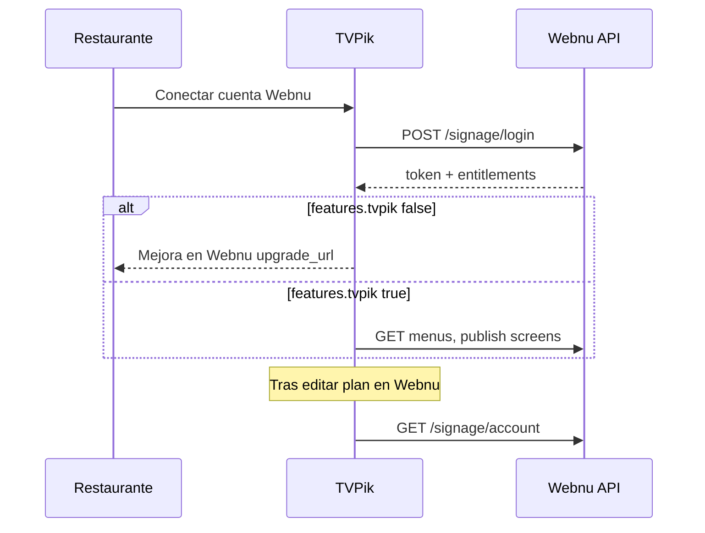

# Facturación unificada: Webnu cobra, TVPik consume permisos

## Decisión de producto

| Responsabilidad | Sistema |
|-----------------|---------|
| Cobros (Stripe, facturas, portal cliente) | **Webnu** |
| Definición de planes y límites | **Webnu** — [`config/plans.php`](../config/plans.php) |
| Pagos manuales (transferencia, etc.) | **Webnu** — campo `users.plan` |
| Pantallas, galerías, reproductor TV | **TVPik** ([piccent](https://github.com/waltersele/piccent)) |
| Editor de carta, QR, URLs `/carta` y `/tv` | **Webnu** |

TVPik **no implementa Stripe ni precios**. Solo consulta permisos vía API y bloquea o permite acciones (publicar pantalla, sincronizar galería, etc.).

## Planes y feature TVPik

| Plan | `tvpik_max_screens` | Notas |
|------|---------------------|--------|
| `free` | `0` | Sin hub TV |
| `pro` | `0` + `users.tvpik_extra_screens` | Add-on Stripe: 1 pantalla (5 €) o pack 5 (20 €) |
| `plus` | `1` incluida + extras | Pantallas adicionales vía add-on |
| `franchise` | Ilimitado (`null`) | Asignación manual |
| Superadmin | Ilimitado | Bypass |

`GET /api/signage/account` devuelve `limits.tvpik_max_screens` desde [`UserPlanService::signageEntitlements()`](../app/Services/UserPlanService.php).

Asignación manual:

```sql
UPDATE users SET plan = 'plus', tvpik_extra_screens = 4 WHERE email = 'cliente@ejemplo.com';
```

Tras el cambio, TVPik debe **volver a llamar** la API de cuenta (o re-login).

---

## API de permisos para TVPik

Base: `https://webnu.es/api/signage`  
Cabecera opcional: `X-Digital-Signage-Key: {DIGITAL_SIGNAGE_APP_KEY}`  
Autenticación: `Authorization: Bearer {api_token}` (token de [`POST /login`](#post-apilogin)).

### `POST /api/signage/login`

Obtiene token y **entitlements** en la misma respuesta (TVPik puede cachear tras conectar).

**Request**

```json
{
  "email": "dueño@restaurante.com",
  "password": "***"
}
```

**Response 200**

```json
{
  "token": "80_chars...",
  "token_type": "Bearer",
  "user": {
    "id": 12,
    "name": "Mi Restaurante",
    "email": "dueño@restaurante.com"
  },
  "entitlements": { "...": "ver esquema abajo" }
}
```

### `GET /api/signage/account`

Fuente de verdad tras conectar o cuando cambie el plan en Webnu. Misma forma que `entitlements` en login.

**Response 200**

```json
{
  "user": { "id": 12, "name": "...", "email": "..." },
  "api_version": "1.0",
  "billing": { ... },
  "plan": { ... },
  "features": { ... },
  "limits": { ... },
  "required_plan_for": { ... }
}
```

### `GET /api/signage/me`

Alias de `account` (compatibilidad).

---

## Esquema `entitlements`

Implementado en [`UserPlanService::signageEntitlements()`](../app/Services/UserPlanService.php).

| Campo | Tipo | Descripción |
|-------|------|-------------|
| `api_version` | string | Versión del contrato (p. ej. `1.0`) |
| `billing.owner` | string | Siempre `"webnu"` |
| `billing.source` | string | `stripe` \| `manual` \| `trial` \| `superadmin` |
| `billing.upgrade_url` | string | URL panel Webnu para mejorar plan |
| `billing.portal_available` | bool | Si puede abrir portal Stripe en Webnu |
| `plan.key` | string | `free`, `plus`, `unlimited` |
| `plan.label` | string | Etiqueta UI |
| `plan.price_label` | string\|null | p. ej. `29,90 €/mes` |
| `plan.trial_active` | bool | Periodo de prueba activo |
| `plan.trial_expired` | bool | Trial caducado sin suscripción |
| `plan.trial_ends_at` | string\|null | ISO8601 |
| `features.tvpik` | bool | **Clave para TVPik** — si `false`, no publicar pantallas |
| `features.videos` | bool | Vídeos en platos (carta Webnu) |
| `features.translation` | bool | Carta multilingüe |
| `features.menu_scan` | bool | Escaneo IA disponible (con cupo) |
| `features.multi_company` | bool | Más de un negocio |
| `limits.max_companies` | int\|null | `null` = sin tope |
| `limits.menu_scans_remaining` | int\|null | Escaneos IA restantes |
| `limits.translation_max_locales` | int\|null | Idiomas extra |
| `limits.tvpik_max_screens` | int\|null | `0` = ninguna; `null` = sin tope (Ilimitado) |
| `required_plan_for.tvpik` | string\|null | p. ej. `"Ilimitado"` para mensajes de upgrade |

### Ejemplo — plan Ilimitado activo

```json
{
  "api_version": "1.0",
  "billing": {
    "owner": "webnu",
    "source": "manual",
    "upgrade_url": "https://webnu.es/admin/settings#plan",
    "portal_available": false
  },
  "plan": {
    "key": "unlimited",
    "label": "Ilimitado",
    "price_label": "29,90 €/mes",
    "trial_active": false,
    "trial_expired": false,
    "trial_ends_at": null
  },
  "features": {
    "tvpik": true,
    "videos": true,
    "translation": true,
    "menu_scan": true,
    "multi_company": true
  },
  "limits": {
    "max_companies": null,
    "menu_scans_remaining": null,
    "translation_max_locales": null,
    "tvpik_max_screens": null
  },
  "required_plan_for": {
    "tvpik": "Ilimitado",
    "videos": "Plus",
    "translation": "Plus"
  }
}
```

### Ejemplo — plan Gratis (TVPik bloqueado)

```json
{
  "features": { "tvpik": false, "...": "..." },
  "limits": { "tvpik_max_screens": 0, "...": "..." },
  "required_plan_for": { "tvpik": "Ilimitado" }
}
```

---

## Comportamiento esperado en TVPik (piccent)



1. **Tras login o guardar token Webnu:** llamar `GET /api/signage/account` y guardar en sesión/cache (TTL 5–15 min).
2. **Antes de publicar o vincular pantalla:** si `features.tvpik !== true` → mostrar CTA con `billing.upgrade_url` y `required_plan_for.tvpik`.
3. **Límite de pantallas:** si `limits.tvpik_max_screens` es número, contar pantallas vinculadas del usuario; si `null`, sin tope.
4. **No duplicar precios** en UI de TVPik; texto tipo: “Facturación gestionada en Webnu”.
5. **Refresh:** al abrir integración Webnu o error 403, refrescar `account`.

## Comportamiento en Webnu (panel)

- Hub [`/admin/tvpik`](../routes/web.php): `UserPlanService::canUseTvpik()` (plan Ilimitado o superadmin).
- Mi carta: republicar TVs si hay `tvpik_screen_links`.
- Ajustes / billing: único lugar para subir de plan ([`docs/PLATFORM-BILLING.md`](PLATFORM-BILLING.md)).

## Resolución de plan (`planKey`)

Orden en [`UserPlanService::planKey()`](../app/Services/UserPlanService.php):

1. Superadmin → `unlimited`
2. Trial activo → `plans.trial_tier` (por defecto `plus`)
3. Suscripción Stripe activa → `subscription_map` o `plus` por defecto
4. Campo `users.plan` (manual / freemium)
5. Default `free`

TVPik debe confiar en **`plan.key` y `features`** de la API, no en su propia tabla de suscripciones.

## Relación con otras APIs

| Endpoint | Uso TVPik |
|----------|-----------|
| `GET /api/signage/account` | Permisos y facturación |
| `GET /api/signage/menus` | Listar cartas del usuario |
| `GET /api/signage/menus/{slug}` | Contenido + `tv_urls` |
| TVPik API ← Webnu hub | `screens`, `publish` — ver [TVPIK-INTEGRATION.md](TVPIK-INTEGRATION.md) |

## SSO (futuro)

La facturación unificada **no requiere** SSO. Cuando exista login compartido, el JWT o sesión SSO debería incluir los mismos claims que `entitlements`, o TVPik seguirá usando `Bearer {api_token}`.

## Checklist implementación TVPik

- [ ] Tras conectar Webnu, guardar `entitlements` de login o `account`
- [ ] UI bloqueo si `features.tvpik === false`
- [ ] Enlace a `billing.upgrade_url` (Webnu)
- [ ] Respetar `limits.tvpik_max_screens` cuando deje de ser solo `0` / `null`
- [ ] No crear suscripciones Stripe en TVPik para el mismo email
- [ ] Refrescar `account` si Webnu devuelve 403 en menús

## Referencias

- Planes: [`config/plans.php`](../config/plans.php)
- Stripe Webnu: [`docs/PLATFORM-BILLING.md`](PLATFORM-BILLING.md)
- Integración técnica TV: [`docs/TVPIK-INTEGRATION.md`](TVPIK-INTEGRATION.md)
- Controlador API: [`app/Http/Controllers/Api/SignageAuthController.php`](../app/Http/Controllers/Api/SignageAuthController.php)
