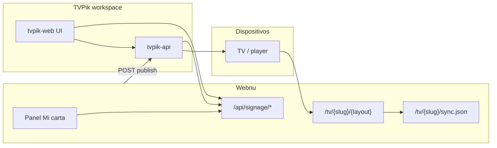
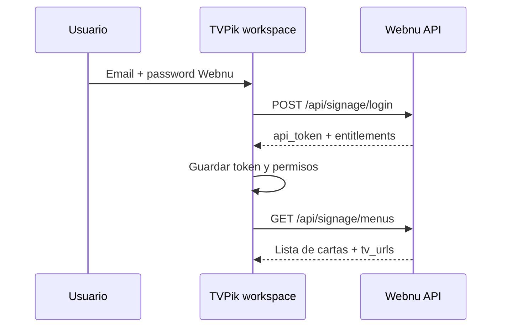

# TVPik Workspace — Conexión API con Webnu

Documento de referencia para implementar el **workspace de TVPik** (panel web / `tvpik-api`): conectar cuentas Webnu, listar cartas, gestionar pantallas, elegir plantilla TV y menú por pantalla, y publicar URLs de reproducción.

**Audiencia:** equipo TVPik (Piccent) y backend Webnu.

**Documentos relacionados:**

| Documento | Contenido |
|-----------|-----------|
| [TVPIK-INTEGRATION.md](TVPIK-INTEGRATION.md) | Resumen operativo Webnu ↔ TVPik |
| [PLATFORM-BILLING-TVPIK.md](PLATFORM-BILLING-TVPIK.md) | Planes, `entitlements`, quién cobra |
| [TV-PLAYER-MODE.md](TV-PLAYER-MODE.md) | Reproductor HDMI/Cast sin app TV |

---

## 1. Roles de cada sistema

| Sistema | Responsabilidad |
|---------|-----------------|
| **Webnu** | Fuente de verdad de la **carta** (negocios, secciones, platos, precios, fotos, vídeos, destacados del día, alérgenos, QR, tema móvil). Genera **URLs TV** (`/tv/...`) optimizadas para pantalla grande. |
| **TVPik workspace** | Gestión de **organización, pantallas y galerías** del local. El restaurante (o franquicia) trabaja aquí para **asignar qué URL se emite en cada TV**. |
| **Reproductor TV** (app TVPik / iframe / navegador) | Muestra la `publish_url` (contenido Webnu) en bucle o playlist. |

**Regla de producto:** la carta se edita en Webnu (o vía API de contenido). TVPik **no duplica** platos ni precios; consume JSON o una URL web.

**Facturación:** solo Webnu cobra planes y add-ons TVPik. El workspace debe leer `features.tvpik` y `limits.tvpik_max_screens` desde la API Webnu — ver [PLATFORM-BILLING-TVPIK.md](PLATFORM-BILLING-TVPIK.md).

---

## 2. Arquitectura de integración



**Dos APIs distintas:**

1. **API de contenido Webnu** (`/api/signage/*`) — la consume TVPik workspace (y cualquier cliente signage).
2. **API de operaciones TVPik** (`/integrations/webnu/*` en `tvpik-api`) — la consume el **hub Webnu** (`/admin/tvpik`) y, en el diseño objetivo, también el **workspace TVPik** para pantallas y publicación.

---

## 3. Conexión de cuentas (tokens)

### 3.1 Token Webnu (`api_token`)

- Columna `users.api_token` (80 caracteres, único).
- Se genera en el primer acceso a **TV / TVPik** en Webnu o en `POST /api/signage/login`.
- Uso: `Authorization: Bearer {api_token}` en todas las rutas `/api/signage/*` (excepto login).

El restaurante puede **copiarlo** en Webnu (`/admin/tvpik`) y pegarlo en TVPik → Integraciones → Webnu.

### 3.2 Token TVPik (`tvpik_api_token`)

- Columna `users.tvpik_api_token` (cifrado en BD).
- Lo genera **TVPik** para el usuario/organización y el dueño lo pega en Webnu al conectar.
- Webnu lo guarda y lo envía en llamadas salientes a `tvpik-api`:
  - `Authorization: Bearer {tvpik_api_token}`
  - Además: `X-Webnu-Token: {api_token}`

### 3.3 Clave de aplicación compartida (recomendada)

Misma clave en ambos `.env`:

| Variable Webnu | Cabecera HTTP |
|----------------|---------------|
| `DIGITAL_SIGNAGE_APP_KEY` | `X-Digital-Signage-Key` |
| `TVPIK_APP_KEY` (o la anterior) | `X-Webnu-App-Key` / `X-Digital-Signage-Key` |

Si la clave está definida en Webnu, **todas** las peticiones a `/api/signage/*` deben incluirla. Si no, solo el Bearer del usuario.

### 3.4 Flujo A — Workspace TVPik conecta Webnu (recomendado para el producto)



1. Formulario login Webnu en TVPik (no sustituye al login TVPik; es **vincular** cuenta carta).
2. `POST /api/signage/login` → guardar `token` y `entitlements`.
3. Opcional: periodicamente `GET /api/signage/account` para refrescar plan.

### 3.5 Flujo B — Webnu conecta TVPik (hub actual)

Implementado en [`TvpikController@connect`](../app/Http/Controllers/Admin/TvpikController.php):

1. Usuario en Webnu pega **token TVPik**.
2. Webnu → `POST {TVPIK_API_URL}/integrations/webnu/connect` con `tvpik_token` + `webnu_token`.
3. Webnu guarda `tvpik_api_token`, `tvpik_connected_at`, `tvpik_org_id`.

El workspace puede exponer el **token TVPik** en Ajustes → Integraciones → Webnu (el que el usuario copia en Webnu).

---

## 4. API Webnu — `/api/signage` (contenido y permisos)

**Base URL:** `https://{dominio-webnu}/api/signage`  
**Versión de contrato:** `api_version` = `1.0` ([`config/digital_signage.php`](../config/digital_signage.php))  
**Middleware:** `digital.signage` (clave app) + `auth:api` (token usuario).

Implementación: [`SignageAuthController`](../app/Http/Controllers/Api/SignageAuthController.php), [`SignageMenuController`](../app/Http/Controllers/Api/SignageMenuController.php), [`MenuSyncService`](../app/Services/MenuSyncService.php).

### 4.1 Cabeceras habituales

| Cabecera | Obligatorio | Descripción |
|----------|-------------|-------------|
| `Authorization` | Sí (salvo login) | `Bearer {api_token}` |
| `X-Digital-Signage-Key` | Si `DIGITAL_SIGNAGE_APP_KEY` en Webnu | Clave compartida app |
| `X-Sync-Version` | No | En `GET menus/{slug}`: si coincide con la carta → `304` sin cuerpo |
| `Accept` | Recomendado | `application/json` |

### 4.2 `POST /login`

Autentica con credenciales Webnu del restaurante.

**Body**

```json
{
  "email": "dueno@restaurante.com",
  "password": "********"
}
```

**Respuesta 200**

```json
{
  "token": "cadena_80_chars...",
  "token_type": "Bearer",
  "user": {
    "id": 12,
    "name": "Brasa y Carbón",
    "email": "dueno@restaurante.com"
  },
  "entitlements": { }
}
```

`entitlements` = salida de [`UserPlanService::signageEntitlements()`](../app/Services/UserPlanService.php). Campos críticos para TVPik:

| Campo | Uso en workspace |
|-------|------------------|
| `features.tvpik` | Si `false`, bloquear publicación y mostrar upgrade |
| `limits.tvpik_max_screens` | Máximo de pantallas vinculadas (`0`, número, o `null` = ilimitado) |
| `billing.upgrade_url` | Enlace a facturación Webnu |
| `required_plan_for.tvpik` | Etiqueta de plan para mensajes (p. ej. `Plus`) |

**Errores:** `401` credenciales incorrectas; `401` clave app inválida.

### 4.3 `GET /account` y `GET /me`

Alias con la misma forma: usuario + `entitlements` completos. Llamar tras cambio de plan o cada 5–15 min en sesión activa.

### 4.4 `GET /menus`

Lista de **negocios / cartas** del usuario.

**Respuesta 200**

```json
{
  "api_version": "1.0",
  "menus": [
    {
      "id": 3,
      "name": "Brasa y Carbón",
      "slug": "brasa-carbon",
      "enabled": true,
      "menu_type": 1,
      "template": "asador",
      "sync_version": "2026-05-24T14:22:10+00:00",
      "public_url": "https://webnu.es/carta/brasa-carbon",
      "api_url": "https://webnu.es/api/signage/menus/brasa-carbon",
      "tv_urls": {
        "default": "https://webnu.es/tv/brasa-carbon",
        "menu": "https://webnu.es/tv/brasa-carbon/menu",
        "spotlight": "https://webnu.es/tv/brasa-carbon/spotlight",
        "featured": "https://webnu.es/tv/brasa-carbon/featured",
        "video": "https://webnu.es/tv/brasa-carbon/video"
      }
    }
  ]
}
```

| Campo | Descripción |
|-------|-------------|
| `menu_type` | `1` = carta digital; `2` = solo PDF |
| `template` | Clave plantilla **QR/móvil** (`lumiere`, `asador`, …) — no confundir con plantilla TV |
| `tv_urls` | URLs listas para asignar a una pantalla según `template_key` TV |

Solo conviene publicar en TV cartas con `menu_type: 1` y `enabled: true`.

### 4.5 `GET /menus/{slug}/version`

Polling ligero sin descargar toda la carta.

**Respuesta 200**

```json
{
  "slug": "brasa-carbon",
  "sync_version": "2026-05-24T14:22:10+00:00",
  "menu_type": 1,
  "enabled": true
}
```

Cabecera respuesta: `X-Sync-Version`.

### 4.6 `GET /menus/{slug}`

Menú completo para render propio en TVPik o para inspección en el workspace.

**Respuesta 200** (carta digital, resumen de campos):

```json
{
  "api_version": "1.0",
  "sync_version": "2026-05-24T14:22:10+00:00",
  "menu_type": "custom",
  "company": {
    "id": 3,
    "name": "Brasa y Carbón",
    "slug": "brasa-carbon",
    "chef_name": null,
    "enabled": true,
    "template": "asador",
    "schedule": null,
    "comments": null,
    "logo_url": "https://webnu.es/img/...",
    "header_url": null,
    "public_url": "https://webnu.es/carta/brasa-carbon"
  },
  "pdf_url": null,
  "sections": [
    {
      "id": 10,
      "name": "Entrantes",
      "order": 1,
      "enabled": true,
      "products": [
        {
          "id": 101,
          "name": "Pulpo a la brasa",
          "description": "...",
          "price_unit": "18.00",
          "price_portion": null,
          "individual_sale": true,
          "weight_sale": false,
          "weight_unit_label": null,
          "highlight": null,
          "enabled": true,
          "order": 1,
          "image_url": "https://webnu.es/img/...",
          "video_url": null,
          "allergens": [
            { "id": 1, "name": "Moluscos", "image_url": "https://webnu.es/img/..." }
          ]
        }
      ]
    }
  ],
  "daily_spotlight": {
    "label": "Especial de hoy",
    "text": "Lubina del mercado",
    "price": "22"
  },
  "highlights": [
    {
      "id": 102,
      "name": "Secreto ibérico",
      "highlight": "Recomendación del chef",
      "price_unit": "24.00",
      "image_url": "https://webnu.es/img/...",
      "video_url": null
    }
  ],
  "tv_urls": {
    "menu": "https://webnu.es/tv/brasa-carbon/menu",
    "spotlight": "https://webnu.es/tv/brasa-carbon/spotlight",
    "featured": "https://webnu.es/tv/brasa-carbon/featured",
    "video": "https://webnu.es/tv/brasa-carbon/video"
  }
}
```

**Carta PDF** (`menu_type: "pdf"`): `sections` vacío, `pdf_url` con URL del PDF, mismos metadatos de empresa.

**Destacados del día:** en panel Webnu pueden existir hasta **3 bloques** (especial / menú del día). En API v1.0, `daily_spotlight` expone el **primer** bloque activo; el resto del contenido del día puede inferirse de `sections` / `highlights` o ampliarse en versiones futuras de API.

**Sincronización condicional:** si envías `X-Sync-Version` igual a `sync_version` → **`304`** sin JSON.

**Errores:** `404` slug inexistente o de otro usuario; `403` negocio desactivado.

### 4.7 Cálculo de `sync_version`

[`MenuSyncService::syncVersion()`](../app/Services/MenuSyncService.php): ISO8601 del máximo entre `companies.updated_at`, última sección y último producto del negocio. Cualquier cambio de plato, precio, especial del día o sección invalida la versión.

---

## 5. Plantillas TV (distintas de la carta QR)

Definidas en [`config/tvpik_templates.php`](../config/tvpik_templates.php). **No** son las 16 plantillas móviles de [`config/company_templates.php`](../config/company_templates.php).

| `template_key` | `layout` | Ruta Webnu | Uso en pantalla |
|----------------|----------|------------|-----------------|
| `menu` | `menu` | `/tv/{slug}/menu` | Carta completa, rotación de secciones |
| `spotlight` | `spotlight` | `/tv/{slug}/spotlight` | Especial del día + destacados |
| `featured` | `featured` | `/tv/{slug}/featured` | Carrusel platos con `highlight` o foto |
| `video` | `video` | `/tv/{slug}/video` | Vídeos cortos de platos |

**Parámetros URL útiles:**

| Query | Efecto |
|-------|--------|
| `player=1` | Modo reproductor pantalla completa (HDMI/Cast) — ver [TV-PLAYER-MODE.md](TV-PLAYER-MODE.md) |
| `preview=1` | Vista previa con contexto admin |
| `lang=en` | Idioma de carta si está activo en el negocio |

**Regla de publicación:** `publish_url` debe ser la URL **`/tv/{slug}/{layout}`**, no `/carta/{slug}` (diseño móvil).

El workspace TVPik debe:

1. Mostrar catálogo de plantillas TV (metadatos: `label`, `description`, `thumbnail` desde Webnu o copia en TVPik).
2. Por pantalla: elegir **carta** (`company_slug` / `menu id`) + **`template_key`**.
3. Resolver URL: usar `tv_urls[template_key]` de `GET /menus` o construir con el mismo patrón de rutas.

---

## 6. API TVPik — contrato para `tvpik-api` (pantallas y publicación)

Webnu llama a estos endpoints cuando el usuario publica desde `/admin/tvpik`. El **workspace TVPik** debe implementar la **misma superficie** para que la gestión de pantallas sea nativa en TVPik.

**Base:** `{TVPIK_API_URL}` (ej. `https://api.tvpik.es`)  
**Config en Webnu:** [`config/tvpik.php`](../config/tvpik.php)

### 6.1 Cabeceras (Webnu → TVPik)

| Cabecera | Cuándo |
|----------|--------|
| `Authorization: Bearer {tvpik_api_token}` | Usuario conectó TVPik desde Webnu |
| `X-Webnu-Token: {api_token}` | Siempre que exista token Webnu |
| `X-Digital-Signage-Key` / `X-Webnu-App-Key` | Si `TVPIK_APP_KEY` configurada |

### 6.2 `POST /integrations/webnu/connect`

Vincula tokens entre productos.

**Body**

```json
{
  "tvpik_token": "token_generado_en_tvpik",
  "webnu_token": "api_token_webnu_80_chars"
}
```

**Respuesta sugerida 200**

```json
{
  "ok": true,
  "org_id": "org_abc123"
}
```

`org_id` opcional; Webnu lo guarda en `users.tvpik_org_id`.

### 6.3 `GET /integrations/webnu/screens`

Lista pantallas del usuario/organización TVPik para el workspace.

**Respuesta sugerida 200**

```json
{
  "screens": [
    {
      "id": "screen_bar_01",
      "name": "Barra",
      "online": true,
      "gallery_id": "12",
      "current_publish_url": "https://webnu.es/tv/brasa-carbon/menu",
      "webnu": {
        "company_slug": "brasa-carbon",
        "template_key": "menu"
      }
    }
  ]
}
```

Campos mínimos que Webnu ya consume: `id`, `name`, `online`, `gallery_id` (opcional).

**Extensión recomendada para workspace:** devolver `webnu.company_slug`, `webnu.template_key`, `current_publish_url` si la pantalla ya está vinculada.

### 6.4 `POST /integrations/webnu/publish`

Asigna qué URL Webnu reproduce esa pantalla (item tipo `web` en galería, iframe en player, etc.).

**Body**

```json
{
  "screen_id": "screen_bar_01",
  "company_slug": "brasa-carbon",
  "template_key": "spotlight",
  "publish_url": "https://webnu.es/tv/brasa-carbon/spotlight",
  "webnu_api_token": "api_token_para_revalidar_permiso"
}
```

**Respuesta sugerida 200**

```json
{
  "ok": true,
  "published_url": "https://webnu.es/tv/brasa-carbon/spotlight",
  "gallery_item_id": "456"
}
```

**Validaciones recomendadas en tvpik-api:**

1. Resolver usuario por `tvpik_token` + `webnu_token`.
2. Opcional: `GET {WEBNU}/api/signage/account` con `webnu_api_token` → comprobar `features.tvpik`.
3. Comprobar límite `limits.tvpik_max_screens`.
4. Crear/actualizar item **web** en la galería de la pantalla con `publish_url`.
5. Persistir vínculo pantalla ↔ slug ↔ `template_key` (en TVPik; Webnu guarda copia en `tvpik_screen_links`).

### 6.5 `GET /integrations/webnu/galleries` (opcional)

Ruta definida en config; no usada aún por el cliente Webnu. Útil en workspace para listar galerías antes de asignar pantalla.

---

## 7. Gestión desde el workspace TVPik (UX objetivo)

### 7.1 Pantallas

| Acción | API / fuente |
|--------|----------------|
| Listar pantallas | `GET /integrations/webnu/screens` (TVPik) o propia `GET /screens` |
| Crear / renombrar / eliminar pantalla | API nativa TVPik (fuera de Webnu) |
| Ver estado online | Campo `online` en `screens` |

Webnu **no** crea pantallas físicas; solo publica contenido en pantallas ya existentes en TVPik.

### 7.2 Por pantalla: carta + plantilla TV

Flujo recomendado en UI:

1. **Conectar Webnu** (login o pegar `api_token`).
2. **Comprobar permisos** (`entitlements.features.tvpik`).
3. **Selector de carta** — datos de `GET /api/signage/menus` (nombre, slug, `sync_version`).
4. **Selector de plantilla TV** — catálogo fijo alineado con `tvpik_templates.php` o endpoint de metadatos Webnu (futuro).
5. **Vista previa** — abrir `tv_urls[template_key]` en iframe o nueva pestaña.
6. **Publicar** — `POST /integrations/webnu/publish` con URL resuelta.

Misma carta en **varias pantallas** con **plantillas distintas** (ej. barra = `spotlight`, comedor = `menu`).

### 7.3 Sincronización cuando cambia la carta en Webnu

Dos mecanismos complementarios:

| Mecanismo | Quién | Cómo |
|-----------|-------|------|
| **A. Republicación TVPik** | Webnu | Al guardar platos, [`SyncCompanyToTvpikScreens`](../app/Jobs/SyncCompanyToTvpikScreens.php) vuelve a llamar `POST .../publish` si existe `tvpik_screen_links` |
| **B. Polling en reproductor** | URL `/tv/...` | `GET /tv/{slug}/sync.json` cada ~30 s; si cambia `sync_version`, recarga la página |

El workspace puede mostrar “Última sync” leyendo `last_synced_at` vía API propia o estado devuelto en `screens`.

### 7.4 Obtener “toda la info” de las cartas

Para **datos estructurados** (platos, precios, alérgenos, imágenes):

- `GET /api/signage/menus/{slug}` — payload completo.

Para **emitir en TV sin render propio**:

- Usar solo `tv_urls` + `publish_url` (iframe a Webnu).

Para **apps que montan UI custom** en TVPik:

- Combinar `sections` + `highlights` + `daily_spotlight` + assets (`image_url`, `video_url`).

---

## 8. Modelo de datos en Webnu (referencia)

### 8.1 `users`

| Campo | Descripción |
|-------|-------------|
| `api_token` | Token API signage |
| `tvpik_api_token` | Token TVPik (cifrado) |
| `tvpik_connected_at` | Fecha conexión |
| `tvpik_org_id` | ID org en TVPik |
| `tvpik_extra_screens` | Pantallas add-on (plan Pro) |
| `plan` | Plan manual / freemium |

### 8.2 `tvpik_screen_links`

Vínculo guardado en Webnu cuando se publica desde el hub:

| Campo | Descripción |
|-------|-------------|
| `user_id`, `company_id` | Propietario y carta |
| `tvpik_screen_id` | ID pantalla en TVPik |
| `tvpik_screen_name` | Etiqueta UI |
| `tvpik_gallery_id` | Galería TVPik (opcional) |
| `template_key` | `menu`, `spotlight`, `featured`, `video` |
| `published_url` | Última URL enviada |
| `sync_version` | Versión carta en última publicación |
| `last_synced_at`, `last_error` | Estado |

Migración: [`2026_05_21_160000_add_tvpik_integration_tables.php`](../database/migrations/2026_05_21_160000_add_tvpik_integration_tables.php).

El workspace TVPik puede mantener su **propia tabla** de vínculos; debe mantenerse coherente con `publish` y, si el usuario también usa Webnu hub, con esta tabla vía el mismo `screen_id`.

---

## 9. Rutas públicas Webnu (reproductor)

| Método | Ruta | Nombre | Uso |
|--------|------|--------|-----|
| GET | `/tv/{slug}` | `tv.show` | Redirección / layout por defecto |
| GET | `/tv/{slug}/{layout}` | `tv.show.layout` | Render plantilla TV |
| GET | `/tv/{slug}/sync.json` | `tv.sync` | Polling modo `player=1` |
| GET | `/carta/{slug}` | `see_menu` | Carta QR móvil (no usar en TV) |

Controlador: [`TvMenuController`](../app/Http/Controllers/TvMenuController.php).

---

## 10. Variables de entorno

### Webnu (`.env`)

```env
# API signage (TVPik workspace consume esto)
DIGITAL_SIGNAGE_APP_KEY=clave_compartida_larga
DIGITAL_SIGNAGE_ONLY_ENABLED=true

# Webnu llama a tvpik-api (hub / republicación)
TVPIK_API_URL=https://api.tvpik.es
TVPIK_APP_KEY=clave_compartida_larga
TVPIK_WEB_URL=https://app.tvpik.es
TVPIK_STUB_SCREENS=false
TVPIK_API_TIMEOUT=15
TVPIK_PLAYER_POLL_SECONDS=30
```

Si `TVPIK_API_URL` está vacío: Webnu usa pantallas **demo** y guarda URLs localmente (`TVPIK_STUB_SCREENS`).

### TVPik (`tvpik-api/.env` sugerido)

```env
WEBNU_API_URL=https://webnu.es
WEBNU_APP_KEY=misma_que_DIGITAL_SIGNAGE_APP_KEY
```

---

## 11. Desarrollo local

| Entorno | Webnu | TVPik workspace |
|---------|-------|-----------------|
| Solo Webnu | `TVPIK_STUB_SCREENS=true`, `php artisan serve` | Apuntar `WEBNU_API_URL=http://127.0.0.1:8000` |
| Prueba TV | `http://127.0.0.1:8000/tv/demo/spotlight?preview=1` | Publicar esa URL en pantalla mock |
| Sync | `http://127.0.0.1:8000/tv/demo/sync.json` | Polling reproductor |

Cola Webnu (republicación automática):

```bash
php artisan queue:work
```

---

## 12. Códigos de error HTTP (resumen)

| Código | Significado habitual |
|--------|----------------------|
| `401` | Token Bearer inválido o clave `X-Digital-Signage-Key` incorrecta |
| `403` | Negocio desactivado o sin permiso TVPik (`features.tvpik`) |
| `404` | `slug` no existe para ese usuario |
| `304` | Carta sin cambios (`X-Sync-Version` actualizado) |
| `422` | Validación (Laravel) en bodies POST |

---

## 13. Checklist implementación workspace TVPik

### Conexión y permisos

- [ ] Pantalla “Conectar Webnu” con `POST /api/signage/login` o pegar `api_token`
- [ ] Guardar `entitlements`; refrescar con `GET /api/signage/account`
- [ ] Bloquear UI si `features.tvpik === false` con enlace `billing.upgrade_url`
- [ ] Respetar `limits.tvpik_max_screens` al vincular pantallas

### Cartas y contenido

- [ ] Listar cartas con `GET /api/signage/menus`
- [ ] Detalle opcional con `GET /api/signage/menus/{slug}`
- [ ] Polling de cambios con `GET /menus/{slug}/version` o cabecera `X-Sync-Version` en menú completo

### Pantallas y publicación

- [ ] CRUD pantallas en TVPik (API propia)
- [ ] Por pantalla: selector carta + plantilla TV (`template_key`)
- [ ] Vista previa `tv_urls[template_key]`
- [ ] `POST /integrations/webnu/publish` con `publish_url` correcta (`/tv/...`)
- [ ] Persistir vínculo `screen_id` ↔ `company_slug` ↔ `template_key`
- [ ] Exponer token TVPik para usuarios que conecten desde Webnu hub

### Reproductor

- [ ] Player carga `publish_url` (iframe o webview)
- [ ] Opcional: modo `?player=1` + poll `sync.json` en dominio Webnu

### No hacer en TVPik

- [ ] No duplicar Stripe/planes de carta (solo Webnu)
- [ ] No usar `/carta/{slug}` como URL principal de TV
- [ ] No asumir que `template` de empresa = plantilla TV

---

## 14. Evolución del contrato (roadmap API)

| Versión | Mejora |
|---------|--------|
| **1.0** (actual) | Signage menus, `tv_urls`, publish screens, entitlements |
| **1.1** (propuesto) | `daily_highlights[]` completo en `GET menus/{slug}`; webhook `carta.updated` hacia TVPik |
| **1.2** (propuesto) | `GET /api/signage/tv-templates` metadatos plantillas TV; SSO compartido |
| **1.3** (propuesto) | Control remoto pantalla (reload, siguiente slide) vía API TVPik |

---

## 15. Referencias de código Webnu

| Componente | Ruta |
|------------|------|
| Rutas API | [`routes/api.php`](../routes/api.php) |
| Rutas TV | [`routes/web.php`](../routes/web.php) |
| Hub admin TVPik | [`TvpikController`](../app/Http/Controllers/Admin/TvpikController.php) |
| Cliente HTTP TVPik | [`TvpikApiClient`](../app/Services/Tvpik/TvpikApiClient.php) |
| Publicación | [`TvpikPublishService`](../app/Services/Tvpik/TvpikPublishService.php) |
| Payload menú | [`MenuSyncService`](../app/Services/MenuSyncService.php) |
| Permisos API | [`UserPlanService::signageEntitlements()`](../app/Services/UserPlanService.php) |
| Job auto-sync | [`SyncCompanyToTvpikScreens`](../app/Jobs/SyncCompanyToTvpikScreens.php) |

Repositorio TVPik de referencia: [github.com/waltersele/piccent](https://github.com/waltersele/piccent) (estructura `tvpik-api`, `tvpik-web`, `tvpik-tv`).
